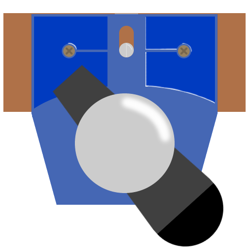

# Vice
### A Powerful Audio Mixer For Windows

## How To Install

1. Have a virtual microphone. Recommended to use [VB-Cable](https://vb-audio.com/Cable).
2. Install Vice.
3. Make Vice output to the new audio device.
4. Make other apps/games to use the audio device

If you would like more info on installation. Look [here](./docs/Installation.md).
